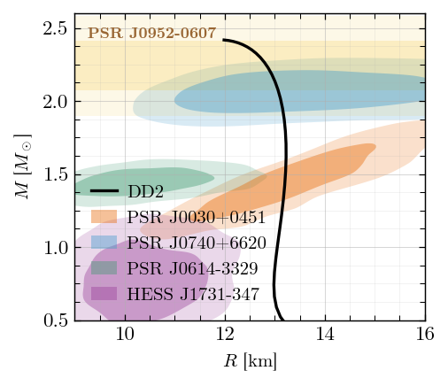

# eos — equations of state for dense nuclear and quark matter

[](https://www.python.org/downloads/)

A Python library for equations of state of dense matter, at zero and finite
temperature: ten models — relativistic mean fields with nucleons, hyperons and
Delta isobars, bag and Nambu–Jona-Lasinio quark matter, colour-superconducting
and colour-flavour-locked phases — plus a composite engine that couples a
hadronic and a quark phase across a first-order transition, and the stellar
structure code that turns any of them into an M–R curve.

What it computes, for every model through the same three functions:

- **thermodynamics** — P, eps, s, the densities of every active species, and
  the chemical potentials, in one of five equilibrium modes;
- **tables** — warm-started grids over n_B, T (or entropy per baryon) and the
  fractions a mode fixes, in the shape a simulation table wants;
- **response functions** — heat capacities, equilibrium and frozen sound
  speeds, adiabatic and thermal indices, and the susceptibility matrix
  chi_ab = dn_a/dmu_b;
- **stellar structure** — TOV with crust attachment, tidal deformability, and
  uniformly rotating models through an RNS backend;
- **figures** — one publication style and a library of observational
  constraints (M–R, M–Lambda, P–n, ...) that overlay onto an axis in one call.


**Author:** Mirco Guerrini (University of Ferrara) ·
**Contact:** mirco.guerrini@unife.it ·
[INSPIRE-HEP](https://inspirehep.net/authors/2775420)

---

## Installation

```bash
pip install git+https://github.com/guerrinimirco/eos.git
```

Python >= 3.11 with NumPy >= 2.0, SciPy >= 1.17, Matplotlib and Numba, all
installed automatically. Nothing else is needed: the neutron-star crust tables and the
observational-constraint contours ship inside the package, so the M–R examples
below run from a fresh clone with no data to fetch and no environment variable
to set.

**The stack the suite is run with.** Development and the test suite use CPython
**3.14.2** with NumPy 2.3.5, SciPy 1.17.0, Numba 0.63.1 and Matplotlib 3.10.9.
That is the interpreter the golden reference tables in `test/baseline/` are
frozen on and the one every audit run in `output/_audit/` is measured with, so
a failure count is only comparable to another taken on the same stack. The
distinction is not cosmetic: those references are held to rtol = 1e-10, tight
enough that a different BLAS moves them. Name the interpreter explicitly rather
than relying on whichever `python` a shell resolves —

```bash
python3 -m pytest test -q          # not `python`, if both are on PATH
```

(the suite itself is not shipped: `test/` is untracked, so a fresh clone has
the library and the examples but no `test/` directory.)

---

## One import deep

```python
import eos                                   # milliseconds; no model is imported yet

par   = eos.dd2.Parameters.named("DD2Y")     # parameters are ARGUMENTS
flags = eos.dd2.SpeciesFlags(hyperons=True,  # every degree of freedom is explicit
                             phi_field=True) # DD2Y is fitted with the SU(6) phi
res   = eos.dd2.eos_point(par, "beta_eq_neutrinoless", flags, n_B=0.32, T=10.0)
print(res.ok, res.point.P)                   # convergence is a RETURN VALUE
```

```
True 32.431587607228806
```

The model packages, the composite engine and `eos.astro` are imported on first
attribute access, so `import eos` costs milliseconds and does not compile ten
models' Numba kernels for the one you asked for. The top level also carries the
vocabulary — `eos.MODELS`, `eos.MODES`, `eos.SPECIES_FLAGS`, the `ModeSpec`
factories, `eos.EOSTable_for_TOV` and the table I/O.

### The uniform API

Every model exposes these three entry points, with these signatures:

```python
eos_point(par, mode, species, **conditions)      # quantities at one point
eos_table(par, mode, species, axes)              # a tabulated EoS over a grid
eos_response(par, mode, species, frozen=..., **conditions)   # 2nd derivatives
```

`par` is the parameter object and is never optional. `mode` is one of the
strings below. `species` is that model's `SpeciesFlags`. The conditions are
named exactly `n_B`, `T` (or `SnB`), `Y_C`, `Y_S`, `Y_Le`, `Y_Lmu` — whichever
the mode makes independent.

**The complete argument-by-argument reference is `docs/API.md`** — every
option of these three calls and of the mixed engine, the TOV driver and the
shared infrastructure, with what each returns. This section is the tour; that
document is the manual.

`Parameters.default()` returns the published parameter set of every model;
where a model has more than one (`dd2`, `sfho`, `did`, `enjl`, `njl`, `ccdm`),
`Parameters.named(key)` selects it, and `Parameters.named("__")` lists the keys
in its error message.

### Modes

A mode fixes the independent variables. All five are `eos.MODES`.

| mode | independent variables | meaning |
|---|---|---|
| `beta_eq_neutrinoless` | (n_B, T) | beta equilibrium, free-streaming neutrinos (mu_nu = 0), charge neutral |
| `beta_eq_neutrino_trapped` | (n_B, Y_Le, [Y_Lmu], T) | beta equilibrium with trapped neutrinos; the muon family is optional |
| `fixed_YC` | (n_B, Y_C, T) | fixed non-leptonic charge fraction — the simulation-table mode |
| `fixed_YC_YS` | (n_B, Y_C, Y_S, T) | fixed charge and strangeness; Y_C = 0.5, Y_S = 0 is symmetric nuclear matter |
| `cfl` | (n_B, T) | colour-flavour-locked quark matter; the locking fixes Y_C = 0 and Y_S = +1 identically |

`cfl` is not a choice of equilibrium condition but a statement about which
phase the model describes, so only the locked-phase models (`alphabag`,
`abpr`) expose it. `fixed_YC` and `fixed_YC_YS` take an orthogonal
`leptons=True/False`: with it, neutralizing electrons (and muons) are added so
the total system is electrically neutral; without it the result is
strongly-interacting matter only, electrically charged, which is what a
mixed-phase construction needs per pure phase. Wherever a temperature is
accepted, entropy per baryon `SnB=` is accepted in its place.

A mode a model cannot support **raises**, naming the gap. Nothing is ever
silently skipped.

### Species flags

Nucleons are always present. Everything else is an explicit named boolean,
carrying the same name in every model (`eos.SPECIES_FLAGS`):

| flag | what it adds |
|---|---|
| `hyperons` | Lambda, Sigma, Xi |
| `deltas` | Delta(1232) |
| `muons` | the muon lepton family |
| `thermal_mesons` | pi, K (and optionally the vector nonet) — these carry C and S, so they enter the charge and strangeness bookkeeping, not only eps, P and s |
| `thermal_neutrinos` | neutrino flavours *not* tracked in the matter composition, as thermal mu = 0 gases |
| `photons` | radiation; carries no conserved charge |

Setting a flag a model does not implement raises. A `NotImplementedError` is
never turned into a silent no-op — and a model that has a sector switches it
with the flag, never implicitly. A model may add flags of its own for physics
only it has: `phi_field` and `sigma_star` for the hidden-strange mesons,
`gluons` in a bag model, `csc` for colour superconductivity.

All ten models carry all six names, so the same six keywords construct a
`SpeciesFlags` anywhere. Carrying a name is not the same as wiring the sector:
`dd2` — and `eos.mixed`, whose own `SpeciesFlags` carries the same six names —
raises `NotImplementedError` on `thermal_neutrinos=True`, because the flavours
a mode does not track are unwired there and dd2's own `neutrinos` field is the
matter-composition electron neutrino of the trapped modes, a different sector.
`dd2` splits section 4's "optionally the vector nonet" off into a secondary
`thermal_vectors`, leaving `thermal_mesons` as the pi, K gas.

**All six default to `False`** — off unless asked for, in every model, so
`SpeciesFlags()` means the same thing everywhere and no call quietly inherits
a sector it did not name. Ask for what the physics needs:
`SpeciesFlags(muons=True, photons=True)` is the usual neutron-star matter at
T > 0.

**A model's own flags follow the same rule.** A flag with two legal values is
a *default* and is `False`, whatever its name; a flag with only one legal
value *raises* on the other and is a *statement* about the model rather than a
default. There is no third category — nothing defaults to `True` and quietly
accepts `False`. So `alphabag.gluons` and `dd2.phi_field` are `False` (both
values are legal physics: a bag model without a thermal gluon gas is the
standard MIT configuration, and `dd2` reads `phi_field` only in conjunction
with `hyperons`, so it is inert in nucleonic matter), while `sfho.phi_field`
and `did.phi_field` are `True` and raise on `False`, because those two models
always solve the field. A **hyperonic DD2Y** run must therefore ask:
`SpeciesFlags(hyperons=True, muons=True, phi_field=True)`. `enjl` is the one exemption
and a different kind of default: it fixes every flag and raises on any move,
so its `hyperons=True` states which baryons the model has (p, n, Lambda)
rather than a default a caller could have changed.

### Conventions

- **Units at every public boundary are fm-based**: n in fm^-3, T and mu in
  MeV, eps and P in MeV/fm^3.
- **Y_C is NON-leptonic**: Y_C = n_C/n_B counts baryons, quarks and charged
  mesons only. Electric neutrality (n_C = n_e + n_mu) is a separate condition
  that a mode may or may not impose.
- **S = +1 per s quark** — the s quark, Lambda and Sigma have S = +1, Xi has
  S = +2. This is the opposite of the PDG convention and is used consistently
  throughout.
- **mu_C = mu_p − mu_n**, so beta equilibrium reads **mu_C + mu_e = 0**.
- Every fraction is relative to n_B: Y_X = n_X/n_B.

---

## Examples

All five are copy-paste runnable and the output below each is what they
actually printed, on the stack the test suite is run with: CPython 3.14.2 with
NumPy 2.3.5 and SciPy 1.17.0. Every digit shown also reproduces on CPython
3.9.7 with NumPy 1.26.4 and SciPy 1.13.1, so these examples do not discriminate
between the two; quantities held to a tighter gate do, which is why
`test/baseline/` is frozen on one named stack (see `pyproject.toml`). Together
they take about half a minute, the M–R sequence being most of it.

### 1. One point, one model, beta equilibrium

```python
from eos.dd2 import Parameters, SpeciesFlags, eos_point

par = Parameters.default()               # the published DD2 table
flags = SpeciesFlags(muons=True, photons=True)   # every d.o.f. is explicit

res = eos_point(par, "beta_eq_neutrinoless", flags, n_B=0.32, T=10.0)
print(res.ok, res.message)

p = res.point
print(f"P    = {p.P:10.4f} MeV/fm^3")
print(f"eps  = {p.eps:10.4f} MeV/fm^3")
print(f"s    = {p.s:10.6f} fm^-3")
print(f"mu_B = {p.matter.mu_B:10.4f} MeV")
print(f"mu_e = {p.leptons.mu_e:10.4f} MeV")
print(f"Y_p  = {p.matter.densities['p'] / p.n_B:10.6f}")
```

```
True converged
P    =    33.0983 MeV/fm^3
eps  =   317.0589 MeV/fm^3
s    =   0.144737 fm^-3
mu_B =  1089.7181 MeV
mu_e =   166.3827 MeV
Y_p  =   0.097031
```

`res.ok` is the convergence status — test it before reading `res.point`. A
sampler that walks into unphysical parameter space gets `False` and a message,
never an exception and never a hang.

### 2. A fixed-Y_C table over n_B and T

```python
import numpy as np
from eos.dd2 import Parameters, SpeciesFlags, eos_table

par, flags = Parameters.default(), SpeciesFlags(muons=True, photons=True)
n_B = np.linspace(0.05, 0.60, 12)
T = [0.0, 10.0, 30.0]

table = eos_table(par, "fixed_YC", flags,
                  axes={"nB": n_B, "T": T}, fixed={"Y_C": 0.3},
                  verbose=True)

print("   n_B      P(T=0)    P(T=10)    P(T=30)   [MeV/fm^3]")
for i, n in enumerate(table.nB):
    row = "".join(f"{line[i].P:11.4f}" for line in table.points)
    print(f"{n:7.4f}{row}")
```

```
[1/3] fixed_YC T=0: 12/12 points in 0.1s
[2/3] fixed_YC T=10: 12/12 points in 0.0s
[3/3] fixed_YC T=30: 12/12 points in 0.0s
   n_B      P(T=0)    P(T=10)    P(T=30)   [MeV/fm^3]
 0.0500    -0.2866     0.0540     1.2291
 0.1000    -0.3580     0.1622     2.5020
 0.1500     0.4688     1.0755     4.3805
 0.2000     3.3238     3.9584     7.9199
 0.2500     9.7544    10.3762    14.6345
 0.3000    21.0824    21.6689    25.9318
 0.3500    38.0403    38.5861    42.6964
 0.4000    60.8351    61.3443    65.2571
 0.4500    89.3780    89.8579    93.5867
 0.5000   123.4636   123.9215   127.5007
 0.5500   162.8642   163.3063   166.7729
 0.6000   207.3684   207.7995   211.1866
```

`table.points` is one line per (temperature, fractions) combination, warm-started
along the density axis — each solved point seeds the next. `verbose=True`
installs the built-in progress printer; pass `progress=` your own callback for
the same dictionary. The negative cold pressures at low density are the
liquid–gas instability of Y_C = 0.3 matter and are real: a raw model branch may
violate P monotonicity, and the check belongs where a table is *delivered* to a
structure solver, which is the next example.

This is the leptonless flavour — strongly-interacting matter only. For the
neutralizing one, `eos_point(..., leptons=True)`, or the mode
`"fixed_YC_neutral"` in a DD2 table.

### 3. That table through the TOV solver: M–R and the maximum mass

```python
import numpy as np
from eos.dd2 import Parameters, SpeciesFlags, eos_table
from eos.general.state import EOSTable_for_TOV
from eos.astro.tov import (compute_tov_sequence, find_mmax_precise,
                           generate_ec_logspace)

par, flags = Parameters.default(), SpeciesFlags(muons=True, photons=True)
cold = eos_table(par, "beta_eq_neutrinoless", flags,
                 axes={"nB": np.geomspace(0.05, 1.25, 150), "T": [0.0]})

line = cold.points[0]                    # one line per (T, fractions) combo
core = EOSTable_for_TOV(P=np.array([p.P for p in line]),
                        epsilon=np.array([p.eps for p in line]),
                        nB=np.array([p.n_B for p in line]))

seq = compute_tov_sequence(core, generate_ec_logspace(150.0, 3000.0, 60),
                           add_crust_table="BPS", n_transition=0.08,
                           verbose=False)

i, e_c, M_max = find_mmax_precise(seq)   # seq columns: e_c n_c P_c R M M_b k2 Lambda
M, R = seq[:i + 1, 4], seq[:i + 1, 3]    # the stable branch
print(f"M_max    = {M_max:.3f} M_sun  at  e_c = {e_c:.1f} MeV/fm^3")
print(f"R(M_max) = {seq[i, 3]:.2f} km")
print(f"R(1.4)   = {np.interp(1.4, M, R):.2f} km")
```

```
M_max    = 2.419 M_sun  at  e_c = 1086.6 MeV/fm^3
R(M_max) = 11.99 km
R(1.4)   = 13.19 km
```

That is the published DD2 neutron star: M_max ~ 2.42 M_sun and
R(1.4) ~ 13.2 km. `EOSTable_for_TOV` — three parallel arrays, P and eps in
MeV/fm^3 and n_B in fm^-3, ordered by increasing density — is the whole
contract between a model and the structure solver. Building one is the model's side; running a sequence
over it is `eos.astro`'s. `add_crust_table="BPS"` uses the crust table shipped
in the package; dropping it costs most of a kilometre in R(1.4), so a missing
table raises rather than quietly returning a smaller star.

### 4. The same model with hyperons

```python
from eos.dd2 import Parameters, SpeciesFlags, eos_point

par = Parameters.named("DD2Y")                    # the hyperonic parameter set
flags = SpeciesFlags(hyperons=True, muons=True, photons=True,
                     phi_field=True)              # DD2Y carries the SU(6) phi

res = eos_point(par, "beta_eq_neutrinoless", flags, n_B=0.6, T=0.0)
print(res.ok, res.message)
for name, n in res.point.matter.densities.items():
    print(f"  Y_{name:<7s} = {n / res.point.n_B:.6f}")
print(f"  P         = {res.point.P:.3f} MeV/fm^3")
```

```
True converged
  Y_p       = 0.139660
  Y_n       = 0.565871
  Y_Lambda  = 0.183203
  Y_Sigma+  = 0.000000
  Y_Sigma0  = 0.000000
  Y_Sigma-  = 0.051713
  Y_Xi0     = 0.000000
  Y_Xi-     = 0.059553
  P         = 135.431 MeV/fm^3
```

Nothing but the flag and the parameter set changed. `hyperons=True` opens the
full octet, and at n_B = 0.6 fm^-3 the Lambda, the Sigma^- and the Xi^- are
populated while the neutral and positive channels are not — the composition is
an output, not a declaration. (DD2 and DD2Y are different published
parameterisations, not one set read through two flag settings, which is why
both are listed in `Parameters.named`.)

### 5. That M–R curve with the observational constraints, in the house style

Continuing from example 3, where `seq` and `i` were computed:

```python
import matplotlib.pyplot as plt
from eos.general.figure_style import set_paper_style, apply_style, save_figure
from eos.general.constraints import overlay

set_paper_style()
fig, ax = plt.subplots(figsize=(3.4, 3.0))
overlay(ax, "M-R")                                   # every M-R constraint shipped
ax.plot(seq[:i + 1, 3], seq[:i + 1, 4], "k-", lw=1.6, label="DD2")
ax.set(xlabel=r"$R$ [km]", ylabel=r"$M$ [$M_\odot$]",
       xlim=(9, 16), ylim=(0.5, 2.6))
apply_style(ax)
save_figure(fig, "dd2_MR")
```

```
Saved: dd2_MR.{png, pdf}
```



`overlay(ax, plane)` draws every constraint available in that plane — here the
NICER measurements of PSR J0030+0451, J0740+6620 and J0614−3329, and
HESS J1731−347, as nested 68%/95% credible regions, plus the PSR J0952−0607
mass measurement as a band. `style="gradient"` shades the posterior density
continuously instead. Other planes are
`"M-Lambda"`, `"Mchirp-Lambdatilde"`, `"P-n"`, `"E-n"` and `"Esym-n"`;
`eos.general.constraints.list_available()` prints what is there. Adding a
constraint is a data entry, not a new code path.

---

## The models

| package | kind | degrees of freedom | what it is |
|---|---|---|---|
| `dd2` | hadronic | N, Y, Delta | density-dependent RMF, the published DD2/DD2Y tables |
| `sfho` | hadronic | N, Y, Delta | nonlinear RMF with the sigma–omega–rho cross coupling A(sigma, omega) |
| `zl` | hadronic | n, p | the Zhao–Lattimer nucleonic functional: six numbers set the six lowest nuclear-matter parameters almost independently |
| `did` | hadronic | N, Y, Delta | RMF whose couplings depend on the isospin asymmetry as well as on the density |
| `vmit` | quark | u, d, s | MIT bag with a repulsive vector interaction |
| `alphabag` | quark | u, d, s, gluons | MIT bag with the leading pQCD correction; unpaired and CFL |
| `abpr` | quark | u, d, s | CFL at T = 0 in closed form — nothing iterates |
| `njl` | quark | u, d, s | three-flavour NJL with the 't Hooft determinant, a vector channel and colour superconductivity; the pairing pattern is an outcome |
| `ccdm` | quark | u, d, s | chiral colour-dielectric: confinement and chiral breaking from one dilaton field |
| `enjl` | both | baryons + quarks | extended NJL — a baryon is a three-quark cluster built from the same constituent masses, so chiral, quarkyonic and deconfinement transitions come from one functional |
| `mixed` | composite | hadronic + quark | the phase-adapter engine: a first-order transition between any declared pair, with the transition window, the quark volume fraction chi and the per-phase charge decomposition as part of the result |
| `zlvmit` | legacy | ZL + vMIT | the first-generation hybrid, kept for its published results and exempt from the uniform API |

Each model carries its own paper-style description with the full set of
equations — the Lagrangian or thermodynamic potential, the parameters and the
reference they are fitted to, the field equations, and the residual row by row
for every mode — as `eos/<model>/<model>.tex` and `.md`. They are written so
that a physicist can reproduce the model without opening the source.

---

## Layout

```
eos/
  general/     shared infrastructure: Fermi and Bose integrals, particle data
               and constants, the conserved-charge basis maps, lepton/photon
               thermodynamics, the thermal meson gas, table I/O, the figure
               style, and the observational constraints
  dd2/ sfho/ zl/ did/ vmit/ alphabag/ abpr/ enjl/ njl/ ccdm/
               one subpackage per model, all laid out the same way:
               parameters.py  species.py  thermodynamics.py  solver.py
               table.py  api.py  verify/  <model>.tex
  mixed/       the composite hadron–quark engine
  zlvmit/      the legacy first-generation hybrid
  astro/
    tov/       TOV, tidal deformability, crust attachment, rotating (RNS)
    gmode/     composition g-modes
docs/          API.md (the full API reference), STRUCTURE.md (where each
               quantity is computed), DEFERRED.md (the per-model gaps ledger),
               and eos.bib
output/        generated tables and figures
```

Inside a model, `thermodynamics.py` computes quantities *from* the state and
never knows which mode it is in; `solver.py` finds the state. Where a model
carries a `backends/`, deleting it changes no number — only the speed.

---

## References

**Models**, one primary reference each — DD2: Typel, Röpke, Klähn, Blaschke &
Wolter, PRC 81, 015803 (2010). SFHo: Steiner, Hempel & Fischer, ApJ 774, 17
(2013), with the hyperon couplings of Fortin, Oertel & Providência, PASA 35,
e044 (2018). ZL: Zhao & Lattimer, PRD 102, 023021 (2020). DID: Frohaug,
Maslov, Dexheimer, Grefa, Jahan, Ratti & Restrepo, arXiv:2511.15646. vMIT:
Gomes, Char & Schramm, ApJ 877, 139 (2019), on the bag of Chodos et al.,
PRD 9, 3471 (1974). alphaBag: Alford, Rajagopal & Wilczek, NPB 537, 443 (1999);
Fischer et al. (2011). ABPR: Alford, Braby, Paris & Reddy, ApJ 629, 969
(2005). NJL: Rüster, Werth, Buballa, Shovkovy & Rischke, PRD 72, 034004
(2005). CCDM: Friedberg & Lee, PRD 15, 1694 (1977) and PRD 18, 2623 (1978).
ENJL: Xia, PRD 110, 014022 (2024).

**Phase transitions** — Constantinou, Guerrini, Zhao, Han & Prakash, PRD 112,
094014 (2025); Constantinou et al., PRD 107, 074013 (2023).

Every citation, with the equation it backs, is in the model documents and in
`docs/eos.bib`. A summary is in M. Guerrini, PhD thesis,
University of Ferrara (2026), Chapter 2.

---


This is a 2026 Python rewrite of code originally written in Mathematica and Python during my PhD (2022–2026). It is mainly for personal use, but if you need help using it, please get in touch. I used Claude Code for this new version.
