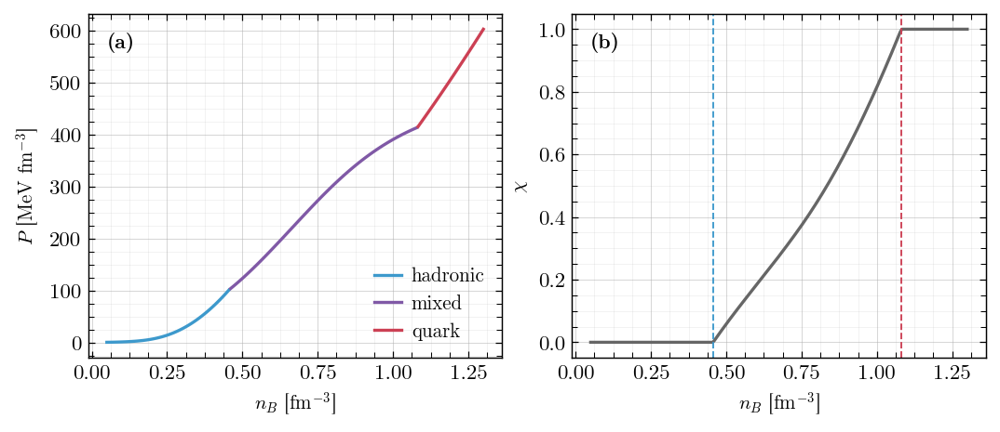

# STRUCTURE — how `eos` is laid out, and where to find a quantity

This document is for a physicist who has never opened this repository and
wants to know **where the thing they care about is computed**. It is the map;
[`README.md`](../README.md) is the tour, and `CLAUDE.md` at the repository root
is the specification the code is held to. Where this document and `CLAUDE.md`
disagree, `CLAUDE.md` wins and this document is the bug.

Every code block below was executed and every output is that run's, on
**python.org CPython 3.14.2** with NumPy 2.3.5, SciPy 1.17.0 and Matplotlib
3.10.9, from the repository root. The last digits of a solved quantity depend
on that stack, and the millisecond timings in §7 and §13 are the only
numbers that move run to run; the physics does not.

**Contents**

1. [Units, and the two conventions that bite](#1-units-and-the-two-conventions-that-bite)
2. [The module map](#2-the-module-map)
3. [Where a quantity is computed](#3-where-a-quantity-is-computed)
4. [Modes](#4-modes)
5. [Species flags](#5-species-flags)
6. [Inside a model: the shape every model has](#6-inside-a-model-the-shape-every-model-has)
7. [The reference/fast contract, and why `backends/` is deletable](#7-the-referencefast-contract-and-why-backends-is-deletable)
8. [`verify/` — the invariant suites](#8-verify--the-invariant-suites)
9. [The model documents](#9-the-model-documents)
10. [The notebooks](#10-the-notebooks)
11. [A worked example, end to end](#11-a-worked-example-end-to-end)
12. [A worked figure](#12-a-worked-figure)
13. [Adding a new model](#13-adding-a-new-model)

---

## 1. Units, and the two conventions that bite

**Every public boundary is fm-based.** Natural units live inside the physics
modules and never cross a module boundary.

| quantity | unit |
|---|---|
| number density `n`, entropy density `s` | fm^-3 |
| temperature `T`, chemical potential `mu`, mass | MeV |
| pressure `P`, energy density `eps`, free energy density `f` | MeV/fm^3 |
| entropy per baryon `SnB` | dimensionless (`s / n_B`) |
| radius | km; mass, in solar masses |

Two conventions in this library are the opposite of what a reader arriving
from the wider literature expects. Both are used **consistently**, and both
are the errors this domain makes most often.

### 1.1 `Y_C` is NON-leptonic

`C` is the electric charge of **strongly-interacting matter only** — baryons,
quarks and charged mesons. Leptons are excluded from `C`. Electric neutrality,
`n_C = n_e + n_mu`, is a *separate* condition that a mode may or may not
impose, and conflating the two is the single most common error here.

### 1.2 `S = +1` per s quark — the OPPOSITE of PDG

The s quark has `S = +1`, so `Lambda` and `Sigma` have `S = +1` and `Xi` has
`S = +2`. The PDG assigns the opposite sign. Never silently flip it.

Both conventions are declared once, in
[`eos/general/basis.py`](../eos/general/basis.py), and imported by every
model. No model carries its own copy of these maps.

```python
from eos.general.basis import charges_of, charges_from_densities

for name in ("p", "n", "Lambda", "Xi-", "s", "u", "e-"):
    B, C, S = charges_of(name)
    print(f"  {name:7s} B = {B:+.4f}   C = {C:+.1f}   S = {S:+.1f}")

n_B, n_C, n_S = charges_from_densities({"p": 0.05, "n": 0.25, "e-": 0.05})
print(f"  n_B = {n_B:.4f}  n_C = {n_C:.4f}  n_S = {n_S:.4f}   "
      f"(the electron is NOT in n_C)")
```

```
  p       B = +1.0000   C = +1.0   S = +0.0
  n       B = +1.0000   C = +0.0   S = +0.0
  Lambda  B = +1.0000   C = +0.0   S = +1.0
  Xi-     B = +1.0000   C = -1.0   S = +2.0
  s       B = +0.3333   C = -0.3   S = +1.0
  u       B = +0.3333   C = +0.7   S = +0.0
  e-      B = +0.0000   C = -1.0   S = +0.0
  n_B = 0.3000  n_C = 0.0500  n_S = 0.0000   (the electron is NOT in n_C)
```

`Lambda` and `Xi-` carry positive strangeness: that is §1.2 on the page.
`charges_of` reports a particle's own electric charge, electron included — the
non-leptonic rule is a property of the **sums**, and
`charges_from_densities` is where it is enforced: the electron in that dict
moves neither `n_B`, `n_C` nor `n_S`.

The consequence in a solved state: `Y_C` is the matter charge fraction, which
in nucleonic matter equals `Y_p` and **not** the lepton fraction. Neutrality
then ties the two together, and beta equilibrium reads `mu_C + mu_e = 0`
because `mu_C = mu_p - mu_n`.

```python
from eos.dd2 import Parameters, SpeciesFlags, eos_point

res = eos_point(Parameters.default(), "beta_eq_neutrinoless",
                SpeciesFlags(muons=True), n_B=0.32, T=0.0)
p = res.point
print(f"  Y_C (matter)   = {p.matter.Y_C:.6f}")
print(f"  Y_p            = {p.matter.Y('p'):.6f}")
print(f"  n_e + n_mu     = {p.leptons.n_charged:.6f} fm^-3")
print(f"  n_C            = {p.matter.n_C:.6f} fm^-3   -> neutral: "
      f"{abs(p.matter.n_C - p.leptons.n_charged) < 1e-10}")
print(f"  mu_C + mu_e    = {p.matter.mu_C + p.leptons.mu_e:.3e} MeV")
```

```
  Y_C (matter)   = 0.093567
  Y_p            = 0.093567
  n_e + n_mu     = 0.029941 fm^-3
  n_C            = 0.029941 fm^-3   -> neutral: True
  mu_C + mu_e    = 0.000e+00 MeV
```

`Y_C = 0.0936` and the charged-lepton density is `0.0299 fm^-3` — the same
*density* `n_C`, a different *fraction*, because `Y_C` is relative to `n_B`.
Every fraction in this library is `Y_X = n_X / n_B`, never relative to a total
particle number.

A thermal meson gas, when it is switched on, carries `C` and `S` too, so
`n_C` and `n_S` above are the TOTAL non-leptonic charges including the mesons,
not baryons-only.

---

## 2. The module map

```
eos/                       the package (the directory is eos/eos/)
  general/                 shared infrastructure — imports nothing else in the repo
    basis.py               conserved-charge maps: (B, C, S) <-> species, both directions
    particles.py           the quantum-number table: masses, spins, B, C, S, degeneracy
    physics_constants.py   hbar c, m_N, M_sun, and the cgs conversions
    fermi_integrals.py     Fermi integrals: JEL, T = 0 closed forms, quadrature
    bose_integrals.py      the same for bosons
    thermodynamics_leptons.py   electrons, muons, neutrinos, photons, neutralization
    thermal_mesons.py      the pi/K (and vector nonet) thermal gas
    pairing.py             BdG spectrum and gap equations for colour superconductivity
    modes.py               ModeSpec: what each mode fixes and which unknowns it needs
    solve.py               the scaled-residual Newton wrapper every solver shares
    state.py               PhaseThermo, LeptonThermo, EoSPoint, EOSTable_for_TOV
    tabulate.py            the warm-started line sweep and the progress callback
    table_io.py            save_table / load_table / export_csv
    compose.py             reading CompOSE tables
    figure_style.py        THE publication style — the only styling module in the repo
    constraints/           observational constraints and the one-call overlay
    verify/                invariants of the shared pieces above

  dd2/ sfho/ zl/ did/                 hadronic models
  vmit/ alphabag/ abpr/ njl/ ccdm/    quark models
  enjl/                               baryons and quarks from one functional
                           each laid out identically — see §6

  mixed/                   the composite hadron-quark engine
    adapters.py            one Phase adapter per model; a pairing is two of them
    boundaries.py          locating the coexistence window (n_onset, n_offset)
    construction.py        the eta construction: Gibbs (0) to Maxwell (1)
    solver.py              the mixed-phase equilibrium solve
    thermodynamics.py      assembling the mixture from the two PhaseThermo blocks
    hybrid.py table.py api.py responses.py verify/

  zlvmit/                  legacy first-generation hybrid, exempt from the uniform API

  astro/                   consumes tables; never imports model internals
    tov/                   solver.py (TOV + tidal), crust.py, rotating.py (RNS)
    gmode/                 composition g-modes in the Cowling approximation

notebooks/                 four grouped usage notebooks (§10), .ipynb paired to .py
docs/                      this file, DEFERRED.md, eos.bib, figures/
output/                    generated tables and plots (gitignored except output/public/)
test/                      the test suite
```

**Imports run one way only:**

```
general/  ->  models  ->  composite engines  ->  astro/
```

`general/` imports nothing else in the repository. **No model imports another
model**, and **no model imports `astro/`** — a model's side of the contract is
producing an `EOSTable_for_TOV` (which lives in `general/`, the layer both may
import); running a stellar sequence over one is `astro`'s side. The two named
carve-outs: `mixed/` may import `eos.astro.tov` because its scan results *are*
M_max and R(1.4); and a model's `verify/` suite may reach sideways to another
model, because an end-to-end invariant sometimes genuinely spans two.
`test/test_imports.py` enforces all of this.

The top level carries the vocabulary, and the model packages are imported
lazily on first attribute access, so `import eos` costs milliseconds:

```python
import eos
print("models :", eos.MODELS)
print("engines:", eos.ENGINES)
print("modes  :", eos.MODES)
print("species:", eos.SPECIES_FLAGS)
```

```
models : ('dd2', 'sfho', 'zl', 'did', 'vmit', 'alphabag', 'abpr', 'enjl', 'njl', 'ccdm')
engines: ('mixed', 'zlvmit')
modes  : ('beta_eq_neutrinoless', 'beta_eq_neutrino_trapped', 'fixed_YC', 'fixed_YC_YS', 'cfl')
species: ('hyperons', 'deltas', 'muons', 'thermal_mesons', 'thermal_neutrinos', 'photons')
```

---

## 3. Where a quantity is computed

This is the table to read first. `<model>` is any of the ten package names
above.

### 3.1 Reading a solved state

Everything a mode returns is on one object,
[`EoSPoint`](../eos/general/state.py). `P`, `eps` and `s` on the point are the
**totals** — matter plus leptons plus photons, which is what a structure
solver integrates; `point.matter.P` and friends are the phase alone.

| quantity | where it lives |
|---|---|
| total `P`, `eps`, `s` | `EoSPoint.P / .eps / .s` |
| matter-only `P`, `eps`, `s` | `EoSPoint.matter.P / .eps / .s` (a `PhaseThermo`) |
| species densities `n_i` | `EoSPoint.matter.densities` — a name → fm^-3 mapping |
| a population fraction `Y_i` | `EoSPoint.matter.Y("Lambda")` |
| `Y_C`, `Y_S` (non-leptonic, meson gas included) | `EoSPoint.matter.Y_C / .Y_S` |
| `n_B`, `n_C`, `n_S` | `EoSPoint.matter.n_B / .n_C / .n_S` |
| conserved-charge potentials `mu_B`, `mu_C`, `mu_S` | `EoSPoint.matter.mu_B / .mu_C / .mu_S` |
| species potentials `mu_i` | `EoSPoint.matter.mu_i` (derived, never independent) |
| effective potentials `mu_eff_i`, Dirac masses `m_eff_i` | `EoSPoint.matter.mu_eff_i / .m_eff_i` |
| the model's mean fields | `EoSPoint.matter.fields`, in the model's own names |
| rearrangement self-energy `Sigma^R` | `EoSPoint.matter.Sigma_R` |
| lepton potentials and densities | `EoSPoint.leptons` (a `LeptonThermo`) |
| entropy per baryon `S/A` | `EoSPoint.entropy_per_baryon` |
| free energy density `f = eps - T s` | `EoSPoint.free_energy_density` |
| the Euler-relation residual | `EoSPoint.euler_residual()`, and `.matter.euler_residual()` |
| convergence | `PointResult.ok` / `.message`; `EoSPoint.converged` / `.error` |

### 3.2 The shared physics — `eos/general/`

| quantity | module : function |
|---|---|
| Fermi integrals at finite T (validated implementation) | `general/fermi_integrals.py` : `solve_fermi_jel` |
| Fermi integrals at T = 0, closed form | `general/fermi_integrals.py` : `solve_fermi_t0` |
| Fermi integrals by quadrature (reference) | `general/fermi_integrals.py` : `Fermi_Numerical`, `solve_fermi_gl`, `kinetic_thermo` |
| inverting `n` for `mu` | `general/fermi_integrals.py` : `invert_fermi_density` |
| Bose integrals | `general/bose_integrals.py` : `solve_bose_jel`, `Bose_Numerical` |
| electrons, muons, neutrinos, photons | `general/thermodynamics_leptons.py` : `electron_thermo`, `muon_thermo`, `neutrino_thermo`, `photon_thermo` |
| the neutralizing lepton solve | `general/thermodynamics_leptons.py` : `neutralizing_leptons` |
| the pi/K thermal gas, its charges and its condensation ratio | `general/thermal_mesons.py` : `thermal_meson_thermo`, `thermal_meson_charges`, `condensation_ratio` |
| `(n_B, n_C, n_S)` from species densities | `general/basis.py` : `charges_from_densities`, `quark_charges` |
| `mu_i` from `(mu_B, mu_C, mu_S)` | `general/basis.py` : `species_potential`, `quark_potentials`, `baryon_potentials` |
| the reverse map, quark potentials → charge potentials | `general/basis.py` : `charge_potentials_from_quarks` |
| particle masses, spins, quantum numbers | `general/particles.py` : `get_particle`, and the module tables |
| `hbar c`, `M_sun`, cgs conversions | `general/physics_constants.py` |
| BdG spectrum, gap equations, pairing patterns | `general/pairing.py` : `bdg_energies`, `pair_block`, `gap_residuals` |
| what a mode fixes and which unknowns it needs | `general/modes.py` : `ModeSpec`, `charge_unknowns`, `charge_conditions` |
| the shared Newton wrapper and its scaled residual | `general/solve.py` : `solve_system`, `scaled_residual_max` |
| the warm-started line sweep, the progress dictionary | `general/tabulate.py` : `sweep_lines`, `print_progress` |
| table save/load/export | `general/table_io.py` : `save_table`, `load_table`, `export_csv` |
| reading a CompOSE table | `general/compose.py` : `read_compose_data`, `ComposeLookup` |
| figure styling, palettes, panel grids | `general/figure_style.py` (§12) |
| observational constraints on an axis | `general/constraints` : `overlay`, `list_available` |

### 3.3 Inside a model

| quantity | module : function |
|---|---|
| the parameter dataclass and its published sets | `<model>/parameters.py` : `Parameters`, `.default()`, `.named(key)` |
| the active degrees of freedom | `<model>/species.py` : `SpeciesFlags` |
| a coupling that is a **function of the state**, e.g. `Gamma_i(n_B)` | `<model>/couplings.py` |
| one species as an ideal gas | `<model>/thermodynamics.py` : `kinetic_thermo` |
| the mean fields at the current state | `<model>/thermodynamics.py` : `mean_fields` |
| the whole block at given potentials | `<model>/thermodynamics.py` : `thermo_from_mu` (every model has this one) |
| the whole block at given densities | `<model>/thermodynamics.py` : `thermo_from_n` (where the model is written that way) |
| the sums `n_B, n_C, n_S, P, eps, s, sum mu_i n_i` | `<model>/thermodynamics.py` : `assemble` |
| the equilibrium conditions | `<model>/solver.py` : `residual` |
| one mode's solve | `<model>/solver.py` : `solve_beta_eq_neutrinoless`, `solve_fixed_yc`, `solve_fixed_yc_ys`, `solve_beta_eq_neutrino_trapped`, `solve_cfl` |
| the cold start and the warm start | `<model>/solver.py` : `default_guess`, `warm_start` |
| the warm-started grid | `<model>/table.py` : `build_table` |
| the public entry points | `<model>/api.py` : `eos_point`, `eos_table`, `eos_response` |
| second derivatives, where they outgrew `api.py` | `<model>/responses.py` |
| nuclear-matter parameters, forward | `<model>/nmp.py` : `compute_nmp` — `dd2`, `sfho`, `zl`, `did` |
| nuclear-matter parameters, inverse | `<model>/nmp.py` : `invert_nmp` / `from_nmp` — `dd2`, `sfho`, `zl` |
| the analytic Jacobian and the jitted kernel | `<model>/backends/` (§7) |
| the model's physics invariants | `<model>/verify/run_full_check.py` (§8) |

### 3.4 The composite engine and the astrophysics

| quantity | module : function |
|---|---|
| one mixed-phase point: `chi`, both phases, the potentials | `mixed/api.py` : `eos_point` |
| the stitched hadronic + mixed + quark core table | `mixed/api.py` : `hybrid_table` |
| the coexistence window `n_onset`, `n_offset` | `mixed/boundaries.py` : `locate_window`, and `EoSTable.n_onset / .n_offset` |
| the `eta` construction, Gibbs to Maxwell | `mixed/construction.py` |
| a phase adapter for one model | `mixed/adapters.py` : `dd2_phase`, `sfho_phase`, `did_phase`, `zl_phase`, `vmit_phase`, `alphabag_phase`, `njl_phase`, `ccdm_phase`, `enjl_branch_pair` |
| `M`, `R`, `M_b`, `k2`, `Lambda` over a sequence | `astro/tov/solver.py` : `compute_tov_sequence`, `solve_tov_single` |
| the maximum mass and the stable branch | `astro/tov/solver.py` : `find_mmax_precise`, `truncate_to_stable_branch` |
| crust attachment | `astro/tov/crust.py` : `add_crust`, `load_crust_table` |
| uniformly rotating models, the Kepler limit | `astro/tov/rotating.py` : `rotating_model`, `kepler_model`, `rratio_scan` |
| composition g-mode frequencies | `astro/gmode/cowling.py` : `solve_gmode`, `gmode_frequency`, `mode_spectrum` |

---

## 4. Modes

A **mode** fixes the independent variables. It is a required argument of every
entry point — defaulting it would pick a physics condition on the caller's
behalf.

| mode | independent variables | meaning |
|---|---|---|
| `beta_eq_neutrinoless` | `(n_B, T)` | beta equilibrium, free-streaming neutrinos (`mu_nu = 0`), charge neutral |
| `beta_eq_neutrino_trapped` | `(n_B, Y_Le, [Y_Lmu], T)` | beta equilibrium with trapped neutrinos; the muon family is optional |
| `fixed_YC` | `(n_B, Y_C, T)` | fixed non-leptonic charge fraction — the simulation-table mode |
| `fixed_YC_YS` | `(n_B, Y_C, Y_S, T)` | fixed charge and strangeness; `Y_C = 0.5, Y_S = 0` is symmetric nuclear matter |
| `cfl` | `(n_B, T)` | colour-flavour-locked quark matter |

Wherever a temperature is accepted, entropy per baryon `SnB=` is accepted in
its place (an outer 1-D solve for `T`).

`fixed_YC` and `fixed_YC_YS` take an orthogonal `leptons=` flag —
`leptons=True` adds neutralizing electrons (and muons) so the total system is
electrically neutral; `leptons=False` returns strongly-interacting matter
only, electrically charged, which is what a mixed-phase construction needs per
pure phase before imposing *global* neutrality. `leptons` is a named argument,
never part of `**conditions`.

`cfl` is the one mode not available to every model, because it is not a choice
of equilibrium condition but a statement about which phase the model
*describes*: a locked phase has no free charge or strangeness fraction to
name. Only `alphabag` and `abpr` expose it, and for `abpr` it is the only mode
there is — which is why that model alone may default its `mode` argument.

The locking is visible in the answer:

```python
from eos.abpr import Parameters, SpeciesFlags, eos_point

r = eos_point(Parameters.default(), "cfl", SpeciesFlags(), n_B=0.8, T=0.0)
p = r.point
print(f"abpr cfl at n_B = 0.8: ok = {r.ok}")
print(f"  Y_C = {p.Y_C:+.12f}   Y_S = {p.Y_S:+.12f}   (locked by the phase)")
print(f"  P   = {p.P_total:.4f} MeV/fm^3   eps = {p.e_total:.4f} MeV/fm^3")
print(f"  n_u = n_d = n_s = {p.n_u:.6f}, {p.n_d:.6f}, {p.n_s:.6f} fm^-3")
```

```
abpr cfl at n_B = 0.8: ok = True
  Y_C = +0.000000000000   Y_S = +1.000000000000   (locked by the phase)
  P   = 224.2725 MeV/fm^3   eps = 833.8153 MeV/fm^3
  n_u = n_d = n_s = 0.800000, 0.800000, 0.800000 fm^-3
```

Equal flavour densities is the locking; `Y_C = 0` and `Y_S = +1` follow from
it identically, and `S = +1` per s quark is why the second number is `+1` and
not `-1`. (`cfl` returns a `CFLPoint`, not the `EoSPoint` of the other four
modes: the phase has no free composition, so the record is a different shape.
`alphabag`'s `cfl` additionally takes the pairing gap as a condition,
`Delta0=`.)

### A mode a model cannot support raises, and says which

Nothing is ever silently skipped. A gap that is physically meaningless and one
that is merely unwired both raise, and the message names it; the ledger of
gaps is [`docs/DEFERRED.md`](DEFERRED.md).

```python
import eos.zl, eos.abpr, eos.dd2

probes = [
    ("zl",   "fixed_YC_YS", dict(Y_C=0.3, Y_S=0.0)),
    ("abpr", "beta_eq_neutrinoless", {}),
    ("dd2",  "cfl", {}),
]
for name, mode, conds in probes:
    mod = getattr(eos, name)
    try:
        mod.eos_point(mod.Parameters.default(), mode, mod.SpeciesFlags(),
                      n_B=0.35, T=0.0, **conds)
        print(f"{name}.{mode}: accepted")
    except Exception as err:
        print(f"{name}.{mode}: {type(err).__name__}: {err}")
```

```
zl.fixed_YC_YS: NotImplementedError: fixed_YC_YS is meaningless for ZL: the model has no strange degree of freedom, so n_S = 0 identically and no Y_S can be imposed. Use fixed_YC, or a model with a strange sector (eos.dd2, eos.sfho, eos.vmit).
abpr.beta_eq_neutrinoless: NotImplementedError: eos.abpr does not support mode 'beta_eq_neutrinoless': beta equilibrium fixes the charge potential through mu_C + mu_e = 0, but colour-flavour locking has already fixed the composition and left mu_C = 0 with no electrons to equilibrate against, so the condition has no free variable to determine. Unpaired quark matter in beta equilibrium is eos.alphabag or eos.vmit
dd2.cfl: ValueError: unknown mode 'cfl'; expected one of ['beta_eq_neutrinoless', 'fixed_YC', 'fixed_YS', 'fixed_YC_YS', 'beta_eq_neutrino_trapped']
```

Note the split between raising and returning. A malformed **call** — an
unknown mode, a missing fraction, a request the model does not implement —
raises, because it is a programming error a sampler would otherwise re-make a
million times. What the **solve** says about the state — non-convergence, a
violated identity — is a return value: `res.ok` is `False` with a message, and
never an exception and never a hang.

---

## 5. Species flags

Nucleons (`n`, `p`) are always present. Every other degree of freedom is an
explicit named boolean, carrying the same name in every model.

| flag | what it adds |
|---|---|
| `hyperons` | Lambda, Sigma, Xi |
| `deltas` | Delta(1232) |
| `muons` | the muon lepton family |
| `thermal_mesons` | pi, K (and optionally the vector nonet) — these carry `C` and `S`, so they enter the charge and strangeness bookkeeping, not only `eps`, `P`, `s` |
| `thermal_neutrinos` | neutrino flavours *not* tracked in the matter composition, as thermal `mu = 0` gases — contribute to `eps`, `P`, `s` only |
| `photons` | radiation; carries no conserved charge |

`thermal_neutrinos` is meaningful alongside `beta_eq_neutrino_trapped`: the
mode says which families are trapped, the flag adds the ones that are not
(under trapping of the e and mu families, the flag means the tau family).

A model may add flags of its own for physics only it has — `phi_field` and
`sigma_star` for the hidden-strange mesons, `gluons` in a bag model, `csc` for
colour superconductivity.

**No sector is enabled or disabled implicitly** because "its coupling happens
to be zero". If a sector is off, its flag is `False`. Setting a flag a model
does not implement **raises**; a `NotImplementedError` is never turned into a
silent no-op:

```python
from eos.dd2 import Parameters, SpeciesFlags, eos_point

try:
    eos_point(Parameters.default(), "beta_eq_neutrinoless",
              SpeciesFlags(thermal_neutrinos=True), n_B=0.3, T=0.0)
except Exception as err:
    print(f"{type(err).__name__}: {err}")
```

```
NotImplementedError: SpeciesFlags: thermal_neutrinos -- the neutrino flavours a mode does not track, carried as mu = 0 gases -- is not wired in dd2. It is NOT `neutrinos`, which is the matter-composition electron neutrino of the trapped modes
```

---

## 6. Inside a model: the shape every model has

Every model is laid out the same way, so a physicist who has read one can
navigate all of them. **The names are mandatory; the existence is
conditional** — a model does not carry an empty module to satisfy the
template, but where it has one of these parts, that part has this name.

```
<model>/
  parameters.py       the parameter dataclass + the named published sets
  species.py          the SpeciesFlags, and the model's quantum numbers
  thermodynamics.py   quantities computed FROM the state
  solver.py           the equilibrium conditions and the solves that close them
  table.py            the grid driver: warm-started sweep + progress callback
  api.py              eos_point / eos_table / eos_response
  verify/             the model's physics-invariant checks
  <model>.tex, .md    the paper-style description

  couplings.py        only where a coupling is a FUNCTION of the state
  nmp.py              only where the model has a nuclear-matter-parameter map
  responses.py        only where the second derivatives outgrew api.py
  backends/           only where the same equations are written more than once
```

**Imports inside a model run one way only:**

```
couplings.py -> parameters.py -> thermodynamics.py -> solver.py -> nmp.py
                                                                -> table.py -> api.py
```

### The one boundary to internalise

**`thermodynamics.py` computes quantities from the state; `solver.py` finds
the state.**

`thermodynamics.py` takes chemical potentials, fields, `T`, the parameters and
the species flags, and returns densities, `P`, `eps`, `s` and their sums —
including any self-consistency internal to the model (the mean fields, a bag
model's flavour densities). `solver.py` takes `n_B`, `T` and a mode's
conditions and finds the potentials and fields that satisfy them.

The test is that **`thermodynamics.py` never knows which mode it is in**: grep
it for `beta`, `Y_C`, `neutral` or `trapped` and you find nothing. This is the
same boundary as the phase-adapter contract seen from inside a model, which is
why `eos/mixed` can consume the thermodynamics half of a model and nothing
else.

### Parameter or coupling?

A **parameter** takes no arguments; a **coupling** is a function of the state.
`Gamma_sigma(n_sat)` is a parameter — a stored number, what an inference run
varies. `Gamma_sigma(n_B)` is a coupling — evaluated at every density, never
stored. So `couplings.py` holds the functional *form* (pure mathematics, no
model numbers in it), `parameters.py` holds the numbers that pin it down, and
the evaluation lives on the parameter object. A mean field is neither: it is a
dynamical variable and belongs to `thermodynamics.py`.

### Names

Three rules, so a physicist who has read one model can read the next without a
translation table:

1. **A name never repeats its package.** `eos.zl.compute_zl_thermo_from_mu`
   says "zl" twice; it is `eos.zl.thermo_from_mu`.
2. **The same job carries the same name in every model** — the vocabulary in
   §3.3 is that list.
3. **A name says what the function takes and returns, not that it computes.**
   In a file called `thermodynamics.py` everything computes; `thermo_from_mu`
   against `thermo_from_n` tells the reader which variables they are handing
   over.

Functions are ordered **by the physics**, not alphabetically and not by call
depth: `thermodynamics.py` reads single species → mean fields → the
per-species loop → the sums; `solver.py` reads guesses → residual → the solve
→ the modes → the sweep.

### Model parameters are arguments

Never module-level constants, never globals. Inference varies couplings,
nuclear-matter parameters and `B` across millions of calls; a parameter that
can only be changed by editing a source file makes inference impossible.
Published sets are *named defaults*: `Parameters.default()`, and
`Parameters.named(key)` where a model has more than one. There is no global
mutable state anywhere — same inputs, same outputs, and model objects are
picklable so multiprocessing and MPI work.

---

## 7. The reference/fast contract, and why `backends/` is deletable

Where a solver exists in two flavours the pattern is fixed:

- the **reference** flavour — plain NumPy/SciPy, readable, straightforwardly
  correct. It lives in `thermodynamics.py` + `solver.py`, it is what
  correctness is judged against, and it is never bypassed or removed.
- the **fast** flavour — Numba-jitted and/or analytic-Jacobian accelerated,
  selected by an argument, and validated against the reference by
  backend-parity checks in `verify/`. It lives in `<model>/backends/`.

**`backends/` is deletable.** Remove the directory and the model gives the
same numbers, only slower — the import site is a `try/except ImportError` that
falls back to the reference path. That is the property that defines the
directory, and it is what keeps the readable implementation readable: a
physicist checking the equations never has to walk past a jitted kernel.

`eos/dd2/solver.py` states it at the import — quoted from the file, not run
here:

```
try:
    from eos.dd2.backends.jacobian import residual_jacobian
    from eos.dd2.backends.kernel_numba import (...)
except ImportError:
    # `backends/` is optional: CLAUDE.md section 5 defines it by the property
    # that deleting it changes no number, only the speed. Without it every
    # solve takes the finite-difference reference path below.
```

The two paths, side by side — `analytic_jac=False` is the reference,
`analytic_jac=True` (the default) the fast one:

```python
import time
import numpy as np
from eos.dd2 import Parameters, SpeciesFlags, eos_point

par, flags = Parameters.default(), SpeciesFlags()
grid = np.linspace(0.10, 0.80, 40)

results = {}
for analytic in (False, True):
    eos_point(par, "beta_eq_neutrinoless", flags, n_B=0.30, T=0.0,
              analytic_jac=analytic)                 # warm the Numba kernels
    t0 = time.perf_counter()
    P = [eos_point(par, "beta_eq_neutrinoless", flags, n_B=n, T=0.0,
                   analytic_jac=analytic).point.P for n in grid]
    results[analytic] = (np.array(P), (time.perf_counter() - t0) / len(grid))

P_ref, t_ref = results[False]
P_fast, t_fast = results[True]
print(f"reference (finite-difference Jacobian): {1e3 * t_ref:6.2f} ms/point")
print(f"fast      (analytic Jacobian)         : {1e3 * t_fast:6.2f} ms/point")
print(f"max relative difference in P          : "
      f"{np.max(np.abs(P_fast - P_ref) / np.abs(P_ref)):.2e}")
```

```
reference (finite-difference Jacobian):   1.59 ms/point
fast      (analytic Jacobian)         :   1.24 ms/point
max relative difference in P          : 4.40e-14
```

`4.4e-14` is round-off against a solver gate of `1e-10`: the same number, as
the contract requires. The derivatives are **hand-derived analytic
Jacobians**, written and tested — an automatic-differentiation (JAX) port was
tried and rejected, because the integral cores and the T = 0 thresholds do not
trace well.

---

## 8. `verify/` — the invariant suites

A `verify/` suite checks **physics invariants**, not unit behaviour, and each
has one entry point, `verify/run_full_check.py`. Thirteen exist: one per
model, one for `mixed/`, one for `general/`, and one for `astro/gmode/`. They
are part of the package, so they run from a fresh clone; `test/` is separate
and is where unit behaviour lives.

The invariants every suite is built on:

- **Euler relation, per phase**: `eps + P = T s + sum_i mu_i n_i`, to ~1e-8
  relative.
- **Free energy**: `f = eps - T s`, and `f = -P + sum_i mu_i n_i`.
- **Rearrangement**: `Sigma^R` enters `mu` and `P`, never `eps`.
- **Delivery gate**: any table *delivered* to a structure solver has `P`
  non-decreasing in `n_B` and `0 <= c_s^2 <= 1`. A raw model branch may
  violate this inside a first-order transition — mechanical instability is
  real physics — and the violation is resolved by a construction (Maxwell,
  Gibbs, or the `eta`-mixed phase) before the table reaches TOV. The gate
  belongs to whoever builds the table: a unit with a `table.py` owes the check,
  a unit that builds no such table does not.

```
$ python3 -m eos.vmit.verify.run_full_check
```

```
vMIT run_full_check: PASS
  [ok ] Euler relation         max_err=9.90e-12  15 states, T=10.0 MeV
  [ok ] free energy            max_err=9.90e-12  f = eps - Ts = -P + sum mu n
  [ok ] vector self-consistency max_err=3.17e-11  V = a hbar c sum n_q, n_q = n(mu_q - V)
  [ok ] bag / vector signs     max_err=0.00e+00  eps_B = -P_B, eps_V = +P_V
  [ok ] mode closures          max_err=8.20e-12  beta, strangeness, neutrality, fixed fractions
  [ok ] free-gas limit         max_err=0.00e+00  a = 0, B = 0 reproduces the Fermi integrals
  [ok ] residual gate          max_err=3.52e-11  0 unconverged, tol 1e-10
  [ok ] causality              max_err=0.00e+00  c_s^2 in [0.407, 0.490]
```

`general/` carries a suite too, because it is the single home of the pieces
every model's correctness rests on — and the ones a wrong result is hardest to
trace back to:

```
$ python3 -m eos.general.verify.run_full_check
```

```
general run_full_check: PASS
  [ok ] Fermi: JEL vs alts       max_err=1.16e-03  scipy 1.2e-03 over 11 points, Gauss-Laguerre 3.1e-04 over 4
  [ok ] Bose: JEL vs alts        max_err=1.05e-03  scipy 6.5e-04, Gauss-Laguerre 1.1e-03, over 8 points
  [ok ] basis vs species table   max_err=1.14e-19  24 hadrons and quarks, 3 leptons
  [ok ] thermal meson gas        max_err=6.42e-17  nonet quantum numbers, Euler at T = 40 MeV
  [ok ] T -> 0 limit             max_err=1.73e-05  4 points, T = 0.1 MeV; the T^2 approach holds
```

**JEL is the validated Fermi/Bose implementation and is never removed.**
Alternatives may be added alongside, each validated against it — supplemented,
never replaced. (Analytic expressions that are genuinely *different physics* —
perturbative-QCD-corrected gases, cutoff-regularized NJL integrals — are model
physics, and live with their model.)

---

## 9. The model documents

Each model carries a paper-style description with the full set of equations —
the Lagrangian or thermodynamic potential, the parameters and the reference
they are fitted to, the field equations, the residual row by row for every
mode, and every quantity the code returns. The test they are written against
is that **a physicist can reproduce the model from the document without
opening the source**.

The `.tex` and the `.md` carry the **same information**, each written natively
for its format: LaTeX mathematics in the one, Markdown-with-mathtext in the
other. Neither is a pointer to the other and neither is a subset. Read
whichever suits you — the `.md` renders on GitHub, the `.tex` compiles against
[`docs/eos.bib`](eos.bib).

| package | kind | document |
|---|---|---|
| `dd2` | hadronic, density-dependent RMF | [dd2.md](../eos/dd2/dd2.md) · [dd2.tex](../eos/dd2/dd2.tex) |
| `sfho` | hadronic, nonlinear RMF with the sigma–omega–rho cross coupling | [sfho.md](../eos/sfho/sfho.md) · [sfho.tex](../eos/sfho/sfho.tex) |
| `zl` | hadronic, the Zhao–Lattimer nucleonic functional | [zl.md](../eos/zl/zl.md) · [zl.tex](../eos/zl/zl.tex) |
| `did` | hadronic, couplings depending on isospin asymmetry as well as density | [did.md](../eos/did/did.md) · [did.tex](../eos/did/did.tex) |
| `vmit` | quark, MIT bag with a repulsive vector interaction | [vmit.md](../eos/vmit/vmit.md) · [vmit.tex](../eos/vmit/vmit.tex) |
| `alphabag` | quark, MIT bag with the leading pQCD correction; unpaired and CFL | [alphabag.md](../eos/alphabag/alphabag.md) · [alphabag.tex](../eos/alphabag/alphabag.tex) |
| `abpr` | quark, CFL at T = 0 in closed form | [abpr.md](../eos/abpr/abpr.md) · [abpr.tex](../eos/abpr/abpr.tex) |
| `njl` | quark, three-flavour NJL with 't Hooft determinant and colour superconductivity | [njl.md](../eos/njl/njl.md) · [njl.tex](../eos/njl/njl.tex) |
| `ccdm` | quark, chiral colour-dielectric | [ccdm.md](../eos/ccdm/ccdm.md) · [ccdm.tex](../eos/ccdm/ccdm.tex) |
| `enjl` | baryons and quarks from one functional | [enjl.md](../eos/enjl/enjl.md) · [enjl.tex](../eos/enjl/enjl.tex) |
| `mixed` | the composite hadron–quark engine | [mixed.md](../eos/mixed/mixed.md) · [mixed.tex](../eos/mixed/mixed.tex) |
| `astro/tov` | stellar structure, tidal deformability, crust, rotation | [tov.md](../eos/astro/tov/tov.md) · [tov.tex](../eos/astro/tov/tov.tex) |
| `astro/gmode` | composition g-modes | [gmode.md](../eos/astro/gmode/gmode.md) · [gmode.tex](../eos/astro/gmode/gmode.tex) |

`eos/zlvmit/` is first-generation legacy code kept for its published results.
It carries no document and is exempt from the uniform API; new hybrid work
goes through `eos/mixed`.

[`docs/DEFERRED.md`](DEFERRED.md) is the tracked ledger of per-model gaps —
every mode, flag and response a model does not yet implement, and why.

---

## 10. The notebooks

Four grouped usage notebooks, in [`notebooks/`](../notebooks). They are
grouped **by physics rather than one per model**, because the figures that
matter overlay several models on one axis. Each `.ipynb` is paired to a `.py`
through jupytext — read or diff the `.py`, run the `.ipynb`.

| notebook | what it walks through |
|---|---|
| [hadronic_eos](../notebooks/hadronic_eos.ipynb) ([.py](../notebooks/hadronic_eos.py)) | ZL, SFHo, DD2, DID: the knobs, a section per mode, parametrisation and the NMP maps, benchmarks, figures |
| [quark_eos](../notebooks/quark_eos.ipynb) ([.py](../notebooks/quark_eos.py)) | vMIT, alphaBag, NJL, CCDM with ABPR alongside; the published parameter sets, whether a bare quark model gives a star, and the pairing sector step by step |
| [enjl_eos](../notebooks/enjl_eos.ipynb) ([.py](../notebooks/enjl_eos.py)) | ENJL: the branch pair, the author's tables reproduced, temperature, and the step-by-step treatment |
| [hybrid_eos](../notebooks/hybrid_eos.ipynb) ([.py](../notebooks/hybrid_eos.py)) | the mixed phase: the two calling forms, all sixteen shipped pairings, `eta` one call at a time, rows-plus-windows, the TOV pass |

Every one opens with a **knobs** cell — the model, the parameter set, the
flags and the grids in one place — so the whole notebook re-runs against a
different model by editing one block. Every one has a section on *reporting a
gap without presenting it as a result*: an unwired mode is shown as a refusal
with its message, never quietly omitted.

---

## 11. A worked example, end to end

A hybrid star: DD2 hadronic matter and vMIT quark matter, coupled across a
first-order transition by the `eta` construction, tabulated, checked, run
through TOV, and differentiated. The blocks run in order in one namespace.

### 11.1 The pairing

A composite engine's *parameter argument* is two parameter sets. Each phase is
declared through an adapter that closes over its own model's parameters; a
pairing is two of them, and a new pairing is a new adapter, never a new
engine.

```python
from eos.dd2 import Parameters as DD2Parameters, SpeciesFlags as DD2Flags
from eos.vmit import Parameters as VMITParameters
from eos.mixed import adapters

par   = DD2Parameters.default()          # the hadronic side's parameters
flags = DD2Flags(muons=True)             # and its species flags
qpar  = VMITParameters.default()         # the quark side's parameters

for phase in (adapters.dd2_phase(par, flags), adapters.vmit_phase(qpar)):
    print(f"{phase.name:5s} baryon slot = {phase.slot('H'):16s} "
          f"supports_S = {phase.supports_S}")
```

```
DD2   baryon slot = mu_tilde_B_H     supports_S = True
vMIT  baryon slot = mu_B_H           supports_S = True
```

Whether a phase's baryon slot carries the **kinetic** potential
(`mu_tilde_B`, DD2 — its rearrangement term depends on the density the solve
is still finding) or the **physical** one (`mu_B`, vMIT) is a declared
property of the phase, never an engine assumption. That is the phase-adapter
contract: the engine maps `(baryon potential, mu_C, mu_S, T)` to a
`PhaseThermo` block and knows nothing else about either model.

DD2 + vMIT is the pairing with published results behind it, so it also has a
front door — `par`, `flags`, `vmit_params=` in the positions every model uses
— which is what the rest of this example calls. The general form is
`phases=(hadronic, quark)`, with `par` and `species` then `None`.

### 11.2 One point inside the mixed phase

```python
from eos.mixed.api import eos_point

res = eos_point(par, "beta_eq_neutrinoless", flags,
                n_B=0.75, T=0.0, eta=0.0, vmit_params=qpar)
print(res.ok, res.message)

pt = res.point
print(f"phase = {pt.phase}     chi = {pt.chi:.6f}")
print(f"mu_B  = {pt.mu_B:9.4f} MeV")
print(f"P     = {pt.P:9.4f} MeV/fm^3      eps = {pt.eps:9.4f} MeV/fm^3")
for tag, th in (("hadronic", pt.th_H), ("quark   ", pt.th_Q)):
    print(f"  {tag}  n_B = {th.n_B:.6f}  n_C = {th.n_C:+.6f}  "
          f"n_S = {th.n_S:+.6f}  P = {th.P:9.4f}")
print(f"  Y_C(H) = {pt.th_H.Y_C:+.6f}   Y_C(Q) = {pt.th_Q.Y_C:+.6f}"
      f"   Y_S(Q) = {pt.th_Q.Y_S:+.6f}")
```

```
True converged
phase = mix     chi = 0.373300
mu_B  = 1552.8228 MeV
P     =  272.5303 MeV/fm^3      eps =  892.0868 MeV/fm^3
  hadronic  n_B = 0.665371  n_C = +0.211923  n_S = +0.000000  P =  272.4269
  quark     n_B = 0.892077  n_C = -0.344523  n_S = +0.968438  P =  272.4269
  Y_C(H) = +0.318504   Y_C(Q) = -0.386204   Y_S(Q) = +1.085599
```

Five things to read off this, and each is a convention from §1 doing work:

- **`chi = 0.3733`** is the quark volume fraction. `phase = 'mix'` says the
  point is inside the coexistence window.
- **The two phase pressures are equal** (`272.4269` both) — mechanical
  equilibrium, which is what the construction imposes.
- **The point's `P` is larger than either** (`272.5303`): the phase pressures
  are matter alone, the point's is the total, and the difference is the
  electrons and muons.
- **Each phase is electrically charged**, and with opposite sign:
  `Y_C(H) = +0.32`, `Y_C(Q) = -0.39`. At `eta = 0` (Gibbs) neutrality is
  imposed **globally**, on the mixture plus its shared lepton sea, not phase
  by phase. This is exactly the case §4's `leptons=False` exists for.
- **`Y_S(Q) = +1.09` is positive** because `S = +1` per s quark. Under the PDG
  sign this number would read `-1.09`, and every comparison against a paper
  using that convention has to flip it.

`eta` is the fraction of charge neutrality imposed *locally*: `0` is Gibbs
(global neutrality, one shared electron sea), `1` is Maxwell (each phase
neutral on its own, a constant-pressure plateau), and in between it stands in
for the surface tension and Coulomb cost. It changes the *shape* of the
unknown vector, so it is a scalar per call and never a table axis.

### 11.3 The table: rows plus windows

A mixed table is **rows plus windows** — the transition boundaries are part of
the result, not a by-product.

```python
import numpy as np
from eos.mixed.api import hybrid_table

n_B_grid = np.linspace(0.05, 1.30, 220)
out = hybrid_table(par, "beta_eq_neutrinoless", flags, n_B_grid=n_B_grid,
                   eta=0.0, T=0.0, vmit_params=qpar)
print(out.ok, out.message)

tab = out.table
print(f"n_onset  = {tab.n_onset:.4f} fm^-3    n_offset = {tab.n_offset:.4f} fm^-3")
for tag in ("H", "mix", "Q"):
    print(f"  {tag:3s} rows: {int((tab.phase == tag).sum()):3d}")
print(f"P non-decreasing: {bool(np.all(np.diff(tab.P) >= 0.0))}")
```

```
True ok
n_onset  = 0.4566 fm^-3    n_offset = 1.0814 fm^-3
  H   rows:  72
  mix rows: 109
  Q   rows:  39
P non-decreasing: True
```

The quark phase appears at `n_B = 0.457 fm^-3` and the hadronic phase is gone
by `1.081 fm^-3`. Every row carries its own `phase` label and `chi`, so the
three segments are addressable. The mode holds in all three: a `fixed_YC`
hybrid is `fixed_YC` everywhere, not a `fixed_YC` window between
beta-equilibrium wings; only `eta` is specific to the mixed region.

`P non-decreasing: True` is the §8 delivery gate, checked *before* the table
goes to a structure solver. That is where it belongs — a raw model branch may
legitimately violate it inside a first-order transition, and the construction
is what resolves the violation.

### 11.4 Through TOV

`EOSTable_for_TOV` — three parallel arrays, `P` and `epsilon` in MeV/fm^3 and
`nB` in fm^-3, ordered by increasing density — is the whole contract between a
model and `eos.astro`. `EoSTable.to_tov()` builds one.

```python
from eos.astro.tov import (compute_tov_sequence, find_mmax_precise,
                           generate_ec_logspace)

seq = compute_tov_sequence(tab.to_tov(),
                           generate_ec_logspace(150.0, 3000.0, 60),
                           add_crust_table="BPS", n_transition=0.08,
                           verbose=False)
i, e_c, M_max = find_mmax_precise(seq)
M, R, Lam = seq[:i + 1, 4], seq[:i + 1, 3], seq[:i + 1, 7]
print(f"M_max       = {M_max:.3f} M_sun  at e_c = {e_c:.1f} MeV/fm^3")
print(f"R(M_max)    = {seq[i, 3]:.2f} km")
print(f"R(1.4)      = {np.interp(1.4, M, R):.2f} km")
print(f"Lambda(1.4) = {np.interp(1.4, M, Lam):.1f}")
```

```
M_max       = 2.254 M_sun  at e_c = 1032.8 MeV/fm^3
R(M_max)    = 12.32 km
R(1.4)      = 13.19 km
Lambda(1.4) = 740.2
```

The sequence columns are `e_c n_c P_c R M M_b k2 Lambda`.
`add_crust_table="BPS"` uses the crust table shipped inside the package;
dropping it costs most of a kilometre in `R(1.4)`, so a missing table raises
rather than quietly returning a smaller star.

Compare with the pure DD2 star of the README, which reproduces on this stack
as `M_max = 2.419 M_sun`, `R(1.4) = 13.19 km`: the radius at 1.4 solar masses
is the same to the digit, because a 1.4 solar-mass star never reaches
`n_onset` and is hadronic throughout. The quark phase costs 0.165 solar masses
at the maximum, and only there. That is the useful shape of a hybrid result —
the transition is invisible in the canonical-mass observables and shows up at
the top of the sequence.

### 11.5 Response functions: what is held fixed

A second derivative is only defined once one says **what is held fixed**, and
that choice encodes which reactions are faster than the perturbation. The
conditioning is always explicit, and a returned name says which — never a bare
`cs2` whose meaning depends on the arguments.

```python
from eos.mixed.api import eos_response

for frozen in ("equilibrium", "chi"):
    r = eos_response(par, "beta_eq_neutrinoless", flags, frozen=frozen,
                     n_B=0.75, T=0.0, eta=0.0, vmit_params=qpar)
    name = "cs2_eq" if frozen == "equilibrium" else "cs2_frozen"
    print(f"frozen={frozen:12s} phase={r['phase']:3s} chi={r['chi']:.6f}  "
          f"{name} = {r[name]:.6f}")
```

```
frozen=equilibrium  phase=mix chi=0.373300  cs2_eq = 0.384439
frozen=chi          phase=mix chi=0.373300  cs2_frozen = 0.588140
```

The two differ by more than fifty percent at the same state, and that is the
physics, not a discrepancy. With `frozen='equilibrium'` nothing is held: `chi`
and both compositions readjust, so compressing the mixture **converts one
phase into the other** rather than stiffening it, and the sound speed is soft.
This is the one the TOV equations take. With `frozen='chi'` the quark volume
fraction is held — the mixture is compressed faster than the phases can
convert — and the matter is stiffer.

For a single-phase model the same three axes appear as: the composition held
(a *set* of quantity names, with `equilibrium` / `fast` / `slow` as presets
that expand to a set), the thermal variable held (`cs2_isothermal` against
`cs2_adiabatic`, which differ at `T > 0` by `C_P/C_V`), and whether leptons
re-neutralize against the held charge. The combinations a function implements
are named in its docstring; one it does not implement raises saying so.

---

## 12. A worked figure

[`eos/general/figure_style.py`](../eos/general/figure_style.py) is the **only**
module in this repository, and in its downstream projects, that sets
matplotlib styling, colours or figure geometry. Do not re-declare
`STANDARD_COLORS` and do not write a second rcParams setter in a submodule —
import them.

Two style families live there and they are **not** interchangeable. Calling
one after the other overwrites the other's rcParams, so pick one per figure:

- **paper** — `set_paper_style` / `paper_grid` / `panel_label`. Built for a
  PRD/REVTeX two-column article: 10 pt text, 300 dpi, inward ticks, no grid,
  and figures constructed at the exact page width they will occupy, so no
  LaTeX rescaling shrinks the fonts.
- **notebook** — `set_global_style` / `setup_scientific_figure` /
  `add_panel_labels` / `apply_style`. Bigger text, 150 dpi, gridlines on,
  arbitrary panel grids, for exploratory work where on-screen readability
  beats page fidelity.

`paper_grid('RxC', mode=...)` sets the figure width from the page it is going
into — `'single'` = 3.375", `'centered'` = 4.75", `'double'` = 7.0" — and
derives the height from the panel aspect, so every panel comes out at a fixed
box aspect and a plane you must read geometrically is never silently
stretched. `save_figure` writes every format at the style's dpi.

Continuing from §11, where `tab` was built:

```python
import matplotlib.pyplot as plt
from eos.general.figure_style import (paper_grid, panel_label, apply_style,
                                      save_figure, STANDARD_COLORS)

fig, axes = paper_grid('1x2', mode='double', placeholder=False, aspect=1.2)
axP, axChi = axes[0]

for tag, colour, label in (("H", 'Blue', "hadronic"),
                           ("mix", 'Purple', "mixed"),
                           ("Q", 'Red', "quark")):
    rows = tab.phase == tag
    axP.plot(tab.n_B[rows], tab.P[rows], lw=1.6,
             color=STANDARD_COLORS[colour], label=label)
axP.set(xlabel=r"$n_B$ [fm$^{-3}$]", ylabel=r"$P$ [MeV fm$^{-3}$]")
apply_style(axP)
panel_label(axP, '(a)')

axChi.plot(tab.n_B, tab.chi, lw=1.6, color=STANDARD_COLORS['Gray'])
axChi.axvline(tab.n_onset, ls='--', lw=0.9, color=STANDARD_COLORS['Blue'])
axChi.axvline(tab.n_offset, ls='--', lw=0.9, color=STANDARD_COLORS['Red'])
axChi.set(xlabel=r"$n_B$ [fm$^{-3}$]", ylabel=r"$\chi$", ylim=(-0.05, 1.05))
apply_style(axChi, legend=False)
panel_label(axChi, '(b)')

save_figure(fig, "docs/figures/structure_dd2_vmit")
```

```
Saved: docs/figures/structure_dd2_vmit.{png, pdf}
```



Panel (b) is `chi` running from 0 to 1 between the two dashed boundaries — the
`n_onset` and `n_offset` printed in §11.3 — and panel (a) is the same three
segments as pressure. The style module also handles the CMU-Serif
missing-minus-sign glyph (ASCII minus plus a mathtext fallback); that
protection is never removed.

For observational constraints on an axis, `eos.general.constraints.overlay(ax,
plane)` draws every constraint shipped in that plane — `"M-R"`,
`"M-Lambda"`, `"Mchirp-Lambdatilde"`, `"P-n"`, `"E-n"`, `"Esym-n"` — as
68%/95% credible regions or as a continuous posterior-density gradient.
`list_available()` prints what is there, and adding a constraint is a data
entry, not a new code path. There is a worked example of that in the
[README](../README.md#5-that-mr-curve-with-the-observational-constraints-in-the-house-style).

---

## 13. Adding a new model

A new model supplies its equations in the shape of §6. Nothing else changes:
no dispatcher gains a branch, no engine learns the model's name.

1. **`eos/<model>/parameters.py`** — a `Parameters` dataclass (that exact
   class name; `VMITParams` would say "vmit" twice in `eos.vmit.VMITParams`),
   with `default()` and, where the model has more than one published set,
   `named(key)`. Every number the model needs is a field. Nothing is a
   module-level constant.
2. **`eos/<model>/species.py`** — a `SpeciesFlags` dataclass carrying §5's six
   names, plus any flag for physics only this model has. A flag the model does
   not implement raises `NotImplementedError` naming the gap; it is never
   ignored.
3. **`eos/<model>/couplings.py`**, only if a coupling is a *function of the
   state*. Pure functional form, no model numbers in it. Constants go in
   `parameters.py`.
4. **`eos/<model>/thermodynamics.py`** — `kinetic_thermo`, `mean_fields`,
   `thermo_from_mu` (and `thermo_from_n` where the model is written that way),
   `assemble`. Import the Fermi and Bose integrals from
   `eos.general.fermi_integrals` / `bose_integrals`; import the charge maps
   from `eos.general.basis`. Do not reimplement either. This file must never
   learn which mode it is in.
5. **`eos/<model>/solver.py`** — `default_guess`, `warm_start`, `residual`,
   and one `solve_<mode>` per mode the model supports, with `<mode>` the §4
   name lowercased. **`par` is the first argument of every one of them and is
   required**, as it is on the uniform API (CLAUDE.md §5): a solver that
   reaches for `Parameters.default()` on the caller's behalf cannot be
   sampled over. Densities, temperatures and fractions follow, named `n_B`,
   `T`, `Y_C`, `Y_S`, `Y_Le`, `Y_Lmu` — **fm-based, with no unit suffix**; a
   natural-units working variable inside the module carries `_nat`, which is
   the only place the two systems are named apart. Use
   `eos.general.solve.solve_system` so the residual scaling and the bounded
   iteration count are the shared ones. Every solve has a bounded iteration
   count and a residual gate.
6. **`eos/<model>/table.py`** — `build_table`, a warm-started sweep along the
   density axis driven by `eos.general.tabulate.sweep_lines`, accepting a
   `progress` callback that is invoked once per completed line with the
   standard dictionary:

   ```python
   import numpy as np
   from eos.dd2 import Parameters, SpeciesFlags, eos_table

   seen = []
   eos_table(Parameters.default(), "fixed_YC", SpeciesFlags(),
             axes={"nB": np.linspace(0.1, 0.5, 9), "T": [0.0, 20.0]},
             fixed={"Y_C": 0.3}, progress=seen.append)
   for info in seen:
       print({k: (round(v, 3) if isinstance(v, float) else v)
              for k, v in info.items()})
   ```

   ```
   {'mode': 'fixed_YC', 'line': 1, 'n_lines': 2, 'temp_key': 'T', 'temp': 0.0, 'fracs': {'Y_C': 0.3}, 'n_solved': 9, 'n_requested': 9, 'elapsed_s': 0.002}
   {'mode': 'fixed_YC', 'line': 2, 'n_lines': 2, 'temp_key': 'T', 'temp': 20.0, 'fracs': {'Y_C': 0.3}, 'n_solved': 9, 'n_requested': 9, 'elapsed_s': 0.008}
   ```

   The same keys in every model, so one printer serves them all. An engine
   with more to report adds keys alongside these; it does not rename them. The
   default is silent, `verbose=True` installs the built-in printer, and deep
   solver code never prints.
7. **`eos/<model>/api.py`** — `eos_point(par, mode, species, **conditions)`,
   `eos_table(par, mode, species, axes)`,
   `eos_response(par, mode, species, frozen=..., **conditions)`. `par` first
   and never optional; `mode` required. A malformed call raises;
   non-convergence is a return value with a status the caller can test.
8. **`eos/<model>/verify/run_full_check.py`** — the Euler relation, the free
   energy identities, the model's own self-consistency, every mode's closure,
   the residual gate, and — if the model builds a table for a structure solver
   — the monotone-`P` / causal-`c_s^2` delivery gate.
9. **`eos/<model>/<model>.tex` and `.md`** — the paper-style description, §9's
   standard, both formats carrying the same content.
10. **`test/<model>/`** — tests named after the physics they check
    (`test_fixed_yc.py`), plus a frozen regression baseline in
    `test/baseline/`. A model's M–R check is a *test*, not a `verify/` entry:
    running a stellar sequence is `astro`'s side of the contract.
11. **`eos/mixed/adapters.py`** — only if the model is to be pairable: one
    `<model>_phase()` factory returning a `Phase`, declaring whether its
    baryon slot carries the kinetic or the physical potential, whether it
    supports strangeness, and which optional capabilities it provides. A new
    pairing is a new adapter, never a new engine.
12. Add the name to `eos.MODELS` in [`eos/__init__.py`](../eos/__init__.py).

Backends come last, and only if profiling asks for them: a `backends/` with
the analytic Jacobian and the jitted kernel, validated against the reference
by a backend-parity check in `verify/`, and deletable without changing a
number.

Two rules that hold throughout, because the library is built for Bayesian
inference and machine-learning surrogates as much as for a single figure:
**model parameters are arguments**, and **non-convergence is a return value**
at every public boundary — never an exception, never a hang. A sampler walks
into unphysical parameter space constantly and must be able to score that
point and move on.

---

## Where the rules live

- `CLAUDE.md` (repository root) — the specification: layering, conventions,
  modes, flags, the uniform API, the invariants, the naming vocabulary.
- [`README.md`](../README.md) — the tour, with five short runnable examples.
- **This file** — the map: where a quantity is computed, and how to add to it.
- [`docs/DEFERRED.md`](DEFERRED.md) — the ledger of per-model gaps.
- [`docs/eos.bib`](eos.bib) — the shared bibliography.
- `eos/<model>/<model>.{tex,md}` — the physics, equation by equation.
